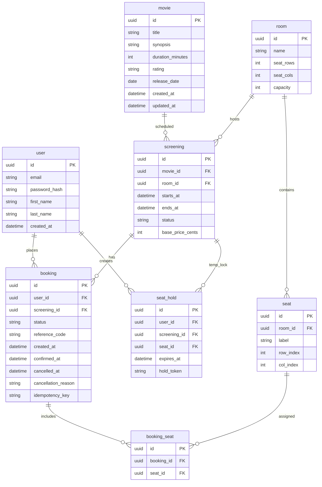
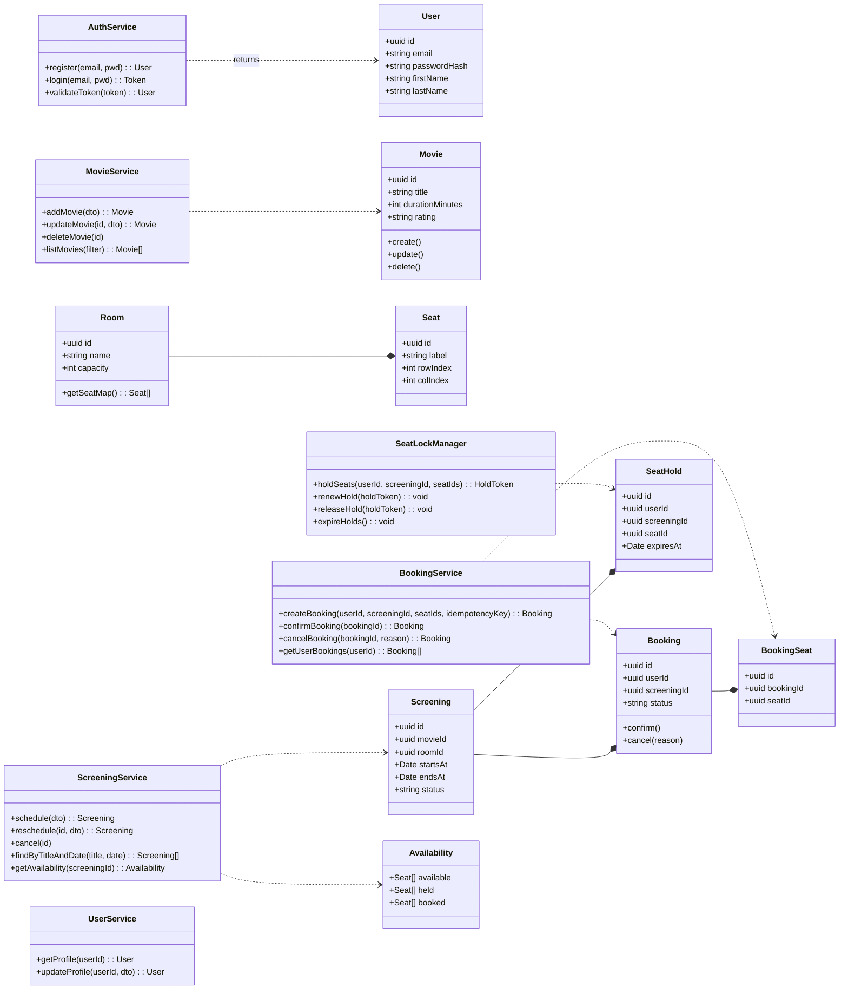
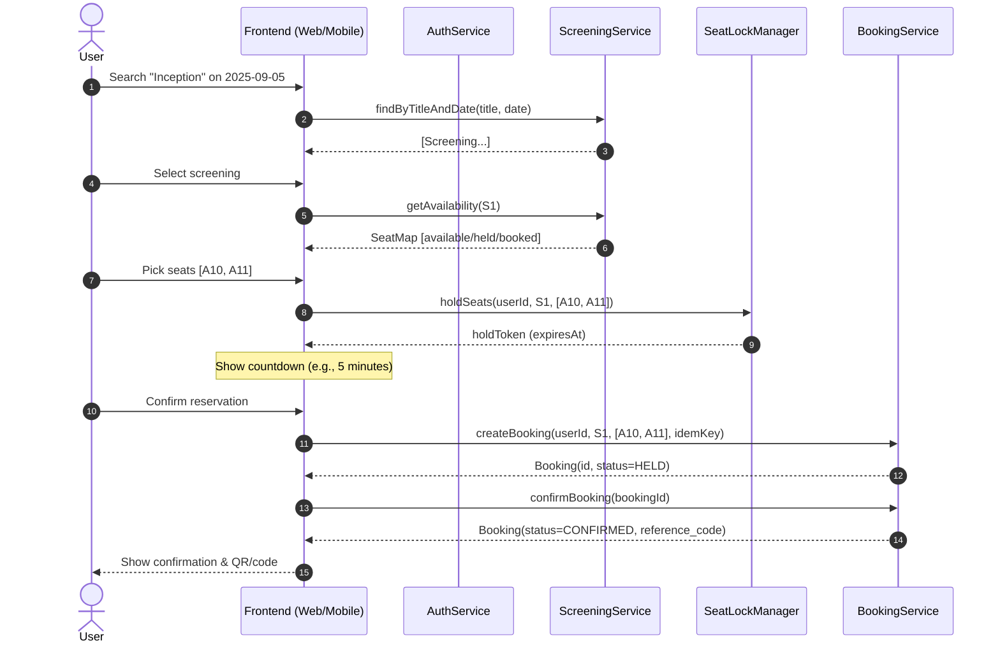
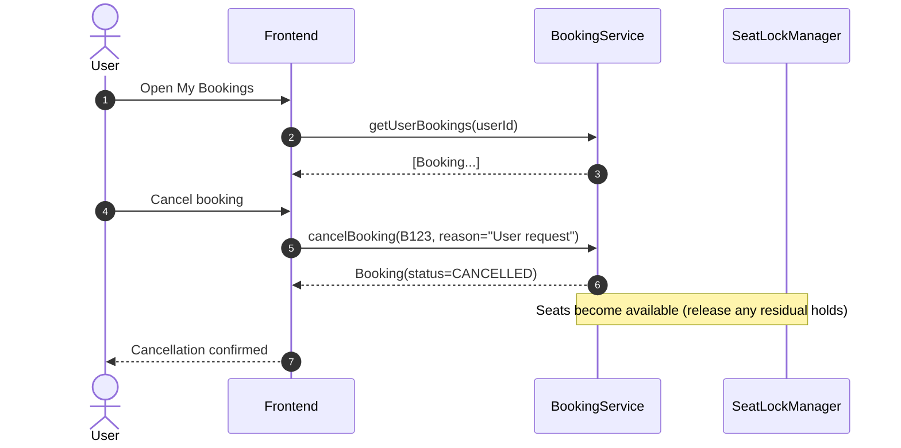
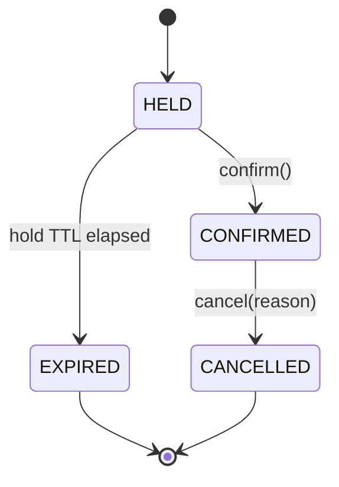
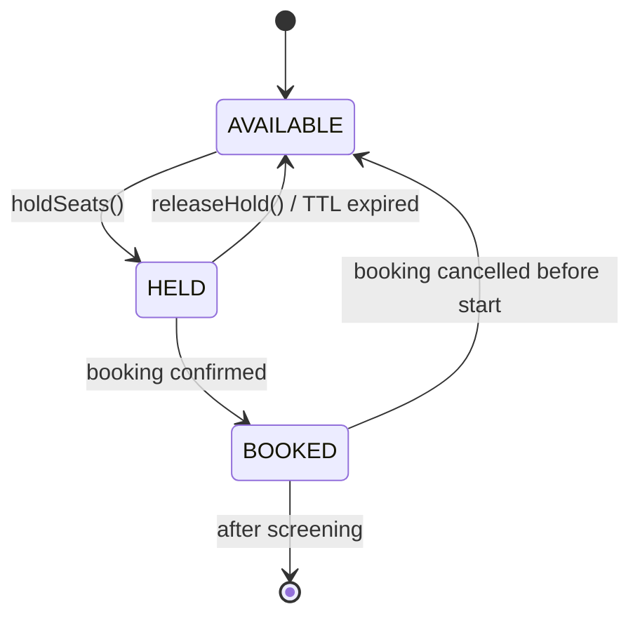
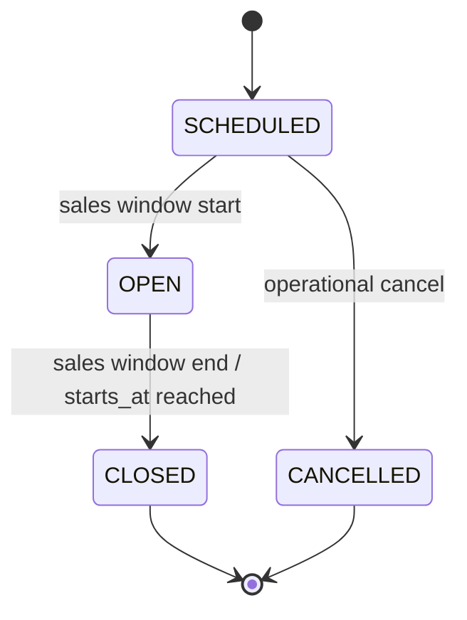

# Cinema Booking System — Design (Mermaid)

> **Candidate:** _Esaú Jaret Gamboa Torres_  
> **Date:** _2025-09-03_  
> **Scope:** Conceptual and logical design only. No code implementation.

---

## 0)Non‑Functional Notes
- The cinema chain has multiple **rooms**, each with fixed **seats**.  
- A **screening** is a scheduled movie show in a room at a start time and (known) end time.  
- Users can **search** by movie title and date, **view availability**, **book specific seats**, and **cancel** bookings.  
- No payment processing is considering for this test; cancellation policy is “free before start time”.  
- Concurrency matters: Friday peaks may approach **4,500 online attendees** (example). We design for:
  - **Seat holds** (short‑lived locks) to avoid double booking.
  - **Idempotent** booking requests and safe retries.
  - Fast lookups via **room/seat map caching** and **screening availability** projections.

---

## 1) Entity‑Relationship Diagram

**Notes**
- `SEAT_HOLD` prevents race conditions by locking a seat for a short TTL (e.g., 5 minutes). Expired holds are cleaned by a job.
- `BOOKING.status` transitions ensure clean cancellation/expiry.

---

## 2) Class Design (Key Services & Entities)

**Method Highlights**
- `SeatLockManager.holdSeats` enforces atomic holds; fails if any seat is unavailable.  
- `BookingService.createBooking` validates an active hold and writes `BOOKING` + `BOOKING_SEAT` atomically; idempotency by `idempotencyKey`.

---

## 3)Sequence Diagram- Reserve Seats

---

## 4) Sequence Diagram — Cancel Reservation

---

## 5) State Diagrams

### 5.1 Booking Lifecycle

### 5.2 Seat Availability (per Screening)

### 5.3 Screening Status

---

## 6) APIs

- **Auth**: `POST /auth/register`, `POST /auth/login`, `GET /profile`  
- **Movies**: `POST /movies`, `PUT /movies/{id}`, `DELETE /movies/{id}`, `GET /movies?title=`  
- **Screenings**: `POST /screenings`, `PUT /screenings/{id}`, `DELETE /screenings/{id}`, `GET /screenings?title=&date=`  
- **Availability**: `GET /screenings/{id}/availability`  
- **Holds**: `POST /screenings/{id}/holds` (seatIds), `DELETE /holds/{token}`  
- **Bookings**: `POST /bookings` (idempotency-key), `POST /bookings/{id}/confirm`, `POST /bookings/{id}/cancel`, `GET /my/bookings`

---feature/esau-gamboa-movie-app
